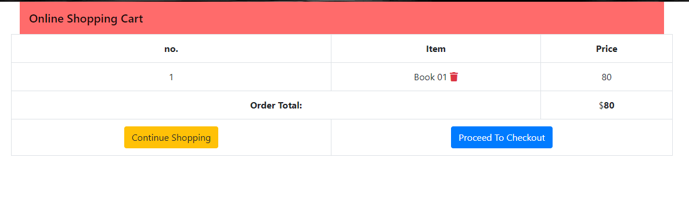

# Django_shopping_cart
Simple shopping cart using Django

#### Install and activate virtual-environment 
```bash
 pip install virtualenv
 virtualenv your_environment_name
 cd your_environment_name
./scripts/activate
 ```
 #### Import project in virtualenv
 ```bash
 git clone https://github.com/nazmul199512/Django_shopping_cart.git
 ```
 
#### Install all  requirements 
```bash
pip install -r requirements.txt
```
#### Run project 
```bash
python manage.py runserver
```

## Database:
* Local: Sqlite


## Screen Shots

### Product added 

### Checkout

